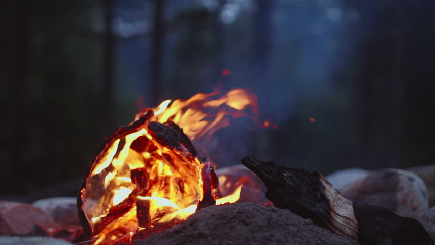
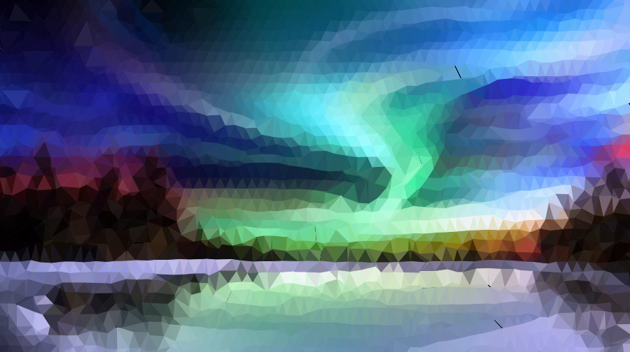
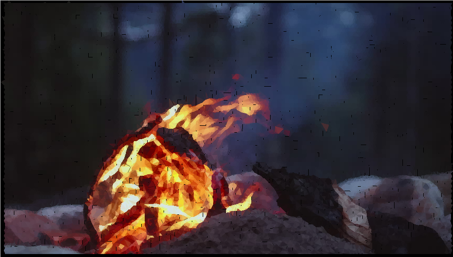

# Trifit, a image compression / art program

Trifit takes input images like these

and give you beautefull triangle versions

and finally, it can create mindustry logic to display the images it creates in game! **(coming soon)**

## Usage

Trifit is a CLI program. to use, pass the path to the input image, and specify the size of the output image, the size of the starting triangle grid, the number of iterations, and the ammount to shift each vertex each step. for example:

`trifit img/aroura_sky.jpg --image-size 900 --tri-size 15 --iterations 50 --shift 0.5`

for more details about useage, run `trifit --help`

### Output formats

you can also specify a file to write the result to, and its format with `--format`. available formats are `svg`, `image` (type determined by file extension), and `mindustry` (again, comeing soon)

### Visualizations

as the program runs, it will open a window to display its progress (it also helps aleviate boredom while the program runs). if this is not desierable, use `--no-visuals` to disable this.

## Installation

### From Source

To build trifit from source, clone this repo and do `cargo build` (or `cargo build --release`). the binary will end up in `./target/debug|release/trifit`

### From crates.io

`cargo install trifit`

## Contribution

Contrbuting is appreciated, feel free to open an issue or pull request. Note that any contribution submitted for inclusion in the project will be licensed according to the terms given in [LICENSE](LICENSE)
